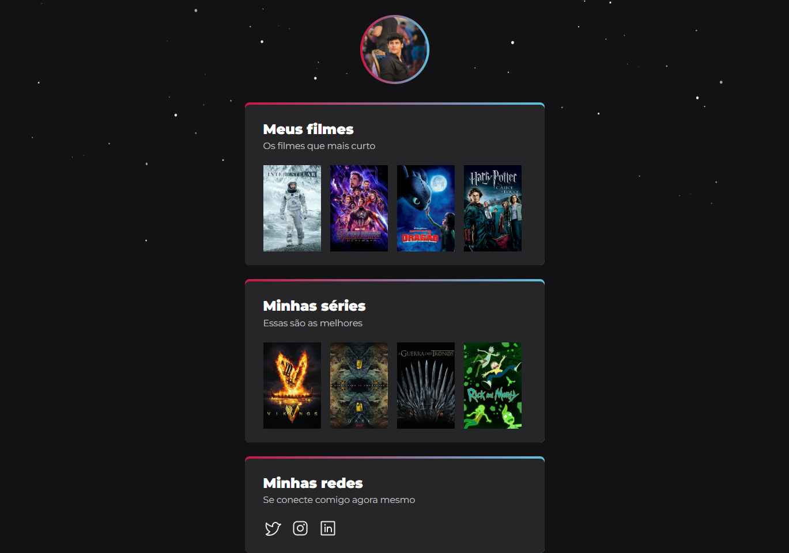

# Challenge NLW#09 - eSports - Explorer

## Acesso

[Clique aqui](https://busolin.github.io/NLW09Challenge-Explorer/)

## Descrição do Projeto

Esse projeto foi desenvolvido baseado no desafio do NLW eSports, colocando em prática
os conceitos de HTML e CSS utilizados no projeto desenvolvido durante a semana do evento.

## Status do Projeto

Concluído ✅

## 🛠 Tecnologias

As seguintes ferramentas foram usadas na construção do projeto:

- HTML
- CSS
- BEMCSS
- Git e GitHub

## Conclusão

Com esse projeto, consegui aplicar diversos conhecimentos de boas práticas, tanto no HTML (desenvolvendo
um HTML semântico), quanto para o CSS (utilizando o padrão de BEM CSS).
